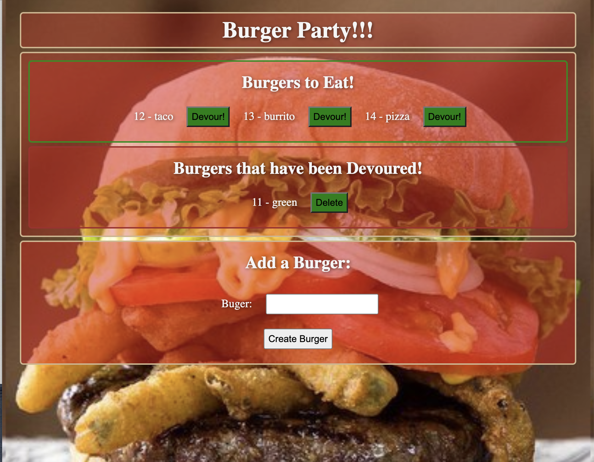

# Burger Party!

A fun little app to save burgers that you'd like to eat. 
## Table of Contents
- [DeployedApp](#deployedApp)
- [Usage](#usage)
- [Images](#images)
- [Languages](#languages)
- [Repository](#repository)
- [Questions](#questions)
## DeployedApp

- https://morning-meadow-19398.herokuapp.com/
## Usage

Use this app to save burgers that you'd like to eat in the future. Then once you've "devoured" them they'll be moved to a list of devoured burgers where they can remain or be deleted if you didn't like them and dont want to remember them.
## Images

## Languages
- [`Java Script`](https://www.javascript.com/)
- [`Jquery`](https://jquery.com/)
- [`Handlebars`](https://handlebarsjs.com/)
- [`CSS`](https://en.wikipedia.org/wiki/CSS)
- [`MySql`](https://www.mysql.com/)
- [`NodeJS`](https://nodejs.org/en/)
- [`npm`](https://www.npmjs.com/)

## Repository
- https://github.com/PeteLow-13/BurgerParty
## Questions

Contact me via email or github with questions
- pedritolow@gmail.com
- [PeteLow-13](http://github.com/PeteLow-13)